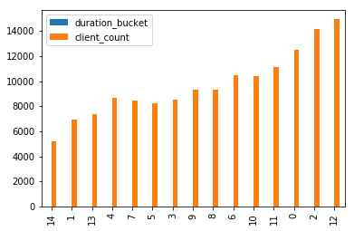
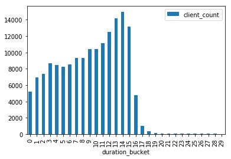
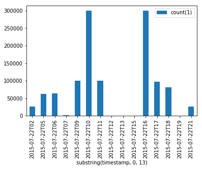

```python
import findspark
findspark.init()
from pyspark.sql import SparkSession

spark = SparkSession.builder \
    .master("yarn") \
    .appName("chris-adhoc") \
    .config('java.library.path', "<--native-libs-->") \
    .config('spark.driver.cores', "8") \
    .config('spark.driver.memory', "8g") \
    .config('spark.executor.cores', "8") \
    .config('spark.executor.memory', "16g") \
    .config('spark.executor.instances', "16") \
    .config('spark.serializer', "org.apache.spark.serializer.KryoSerializer") \
    .config("spark.sql.warehouse.dir", "<--warehouse-location-->") \
    .enableHiveSupport()\
    .getOrCreate()
```


```python
%matplotlib inline
```


```python
inputDF = spark.read.option("delimiter", " ").csv("<--file-location-->/2015_07_22_mktplace_shop_web_log_sample.log.gz")
```

# Check data


```python
inputDF.count()
```


    1158500


```python
sampledRows= inputDF.take(10)
```


```python
sampledRows
```


    [Row(_c0='2015-07-22T09:00:28.019143Z', _c1='marketpalce-shop', _c2='123.242.248.130:54635', _c3='10.0.6.158:80', _c4='0.000022', _c5='0.026109', _c6='0.00002', _c7='200', _c8='200', _c9='0', _c10='699', _c11='GET https://paytm.com:443/shop/authresponse?code=f2405b05-e2ee-4b0d-8f6a-9fed0fcfe2e0&state=null HTTP/1.1', _c12='Mozilla/5.0 (Windows NT 6.1; WOW64) AppleWebKit/537.36 (KHTML, like Gecko) Chrome/43.0.2357.130 Safari/537.36', _c13='ECDHE-RSA-AES128-GCM-SHA256', _c14='TLSv1.2'),
     Row(_c0='2015-07-22T09:00:27.894580Z', _c1='marketpalce-shop', _c2='203.91.211.44:51402', _c3='10.0.4.150:80', _c4='0.000024', _c5='0.15334', _c6='0.000026', _c7='200', _c8='200', _c9='0', _c10='1497', _c11='GET https://paytm.com:443/shop/wallet/txnhistory?page_size=10&page_number=0&channel=web&version=2 HTTP/1.1', _c12='Mozilla/5.0 (Windows NT 6.1; rv:39.0) Gecko/20100101 Firefox/39.0', _c13='ECDHE-RSA-AES128-GCM-SHA256', _c14='TLSv1.2'),
     Row(_c0='2015-07-22T09:00:27.885745Z', _c1='marketpalce-shop', _c2='1.39.32.179:56419', _c3='10.0.4.244:80', _c4='0.000024', _c5='0.164958', _c6='0.000017', _c7='200', _c8='200', _c9='0', _c10='157', _c11='GET https://paytm.com:443/shop/wallet/txnhistory?page_size=10&page_number=0&channel=web&version=2 HTTP/1.1', _c12='Mozilla/5.0 (Windows NT 6.1) AppleWebKit/537.36 (KHTML, like Gecko) Chrome/43.0.2357.134 Safari/537.36', _c13='ECDHE-RSA-AES128-GCM-SHA256', _c14='TLSv1.2'),
     Row(_c0='2015-07-22T09:00:28.048369Z', _c1='marketpalce-shop', _c2='180.179.213.94:48725', _c3='10.0.6.108:80', _c4='0.00002', _c5='0.002333', _c6='0.000021', _c7='200', _c8='200', _c9='0', _c10='35734', _c11='GET https://paytm.com:443/shop/p/micromax-yu-yureka-moonstone-grey-MOBMICROMAX-YU-DUMM141CD60AF7C_34315 HTTP/1.0', _c12='-', _c13='ECDHE-RSA-AES128-GCM-SHA256', _c14='TLSv1.2'),
     Row(_c0='2015-07-22T09:00:28.036251Z', _c1='marketpalce-shop', _c2='120.59.192.208:13527', _c3='10.0.4.217:80', _c4='0.000024', _c5='0.015091', _c6='0.000016', _c7='200', _c8='200', _c9='68', _c10='640', _c11='POST https://paytm.com:443/papi/v1/expresscart/verify HTTP/1.1', _c12='Mozilla/5.0 (Windows NT 6.1; WOW64) AppleWebKit/537.36 (KHTML, like Gecko) Chrome/44.0.2403.89 Safari/537.36', _c13='ECDHE-RSA-AES128-GCM-SHA256', _c14='TLSv1.2'),
     Row(_c0='2015-07-22T09:00:28.033793Z', _c1='marketpalce-shop', _c2='117.239.195.66:50524', _c3='10.0.6.195:80', _c4='0.000024', _c5='0.02157', _c6='0.000021', _c7='200', _c8='200', _c9='0', _c10='60', _c11='GET https://paytm.com:443/api/user/favourite?channel=web&version=2 HTTP/1.1', _c12='Mozilla/5.0 (Windows NT 6.1) AppleWebKit/537.36 (KHTML, like Gecko) Chrome/43.0.2357.134 Safari/537.36', _c13='ECDHE-RSA-AES128-GCM-SHA256', _c14='TLSv1.2'),
     Row(_c0='2015-07-22T09:00:28.055029Z', _c1='marketpalce-shop', _c2='101.60.186.26:33177', _c3='10.0.4.244:80', _c4='0.00002', _c5='0.001098', _c6='0.000022', _c7='200', _c8='200', _c9='0', _c10='1150', _c11='GET https://paytm.com:443/favicon.ico HTTP/1.1', _c12='Mozilla/5.0 (Windows NT 6.3; rv:27.0) Gecko/20100101 Firefox/27.0', _c13='ECDHE-RSA-AES128-GCM-SHA256', _c14='TLSv1.2'),
     Row(_c0='2015-07-22T09:00:28.050298Z', _c1='marketpalce-shop', _c2='59.183.41.47:62014', _c3='10.0.4.227:80', _c4='0.000021', _c5='0.008161', _c6='0.000021', _c7='200', _c8='200', _c9='0', _c10='72', _c11='GET https://paytm.com:443/papi/rr/products/6937770/statistics?channel=web&version=2 HTTP/1.1', _c12='Mozilla/5.0 (Windows NT 6.3; WOW64) AppleWebKit/537.36 (KHTML, like Gecko) Chrome/43.0.2357.134 Safari/537.36', _c13='ECDHE-RSA-AES128-GCM-SHA256', _c14='TLSv1.2'),
     Row(_c0='2015-07-22T09:00:28.059081Z', _c1='marketpalce-shop', _c2='117.239.195.66:50538', _c3='10.0.4.227:80', _c4='0.000019', _c5='0.001035', _c6='0.000021', _c7='200', _c8='200', _c9='0', _c10='396', _c11='GET https://paytm.com:443/images/greyStar.png HTTP/1.1', _c12='Mozilla/5.0 (Windows NT 6.1) AppleWebKit/537.36 (KHTML, like Gecko) Chrome/43.0.2357.134 Safari/537.36', _c13='ECDHE-RSA-AES128-GCM-SHA256', _c14='TLSv1.2'),
     Row(_c0='2015-07-22T09:00:28.054939Z', _c1='marketpalce-shop', _c2='183.83.237.83:49687', _c3='10.0.6.108:80', _c4='0.000023', _c5='0.008762', _c6='0.000021', _c7='200', _c8='200', _c9='0', _c10='214', _c11='GET https://paytm.com:443/shop/cart?channel=web&version=2 HTTP/1.1', _c12='Mozilla/5.0 (Windows NT 6.1; WOW64) AppleWebKit/537.36 (KHTML, like Gecko) Chrome/43.0.2357.124 Safari/537.36', _c13='ECDHE-RSA-AES128-GCM-SHA256', _c14='TLSv1.2')]


```python
inputDF.printSchema
```


    <bound method DataFrame.printSchema of DataFrame[_c0: string, _c1: string, _c2: string, _c3: string, _c4: string, _c5: string, _c6: string, _c7: string, _c8: string, _c9: string, _c10: string, _c11: string, _c12: string, _c13: string, _c14: string]>


```python
inputDF.createOrReplaceTempView("input")
```

# Put schema


```python
spark.sql("""select _c0 as timestamp, _c1 as elb, _c2 as client_ip from input""").createOrReplaceTempView("normInput")
```

# Check unique clients


```python
spark.sql("""select count(distinct(client_ip)) from normInput""").toPandas()
```


<div>
<style scoped>
    .dataframe tbody tr th:only-of-type {
        vertical-align: middle;
    }

    .dataframe tbody tr th {
        vertical-align: top;
    }

    .dataframe thead th {
        text-align: right;
    }
</style>
<table border="1" class="dataframe">
  <thead>
    <tr style="text-align: right;">
      <th></th>
      <th>count(DISTINCT client_ip)</th>
    </tr>
  </thead>
  <tbody>
    <tr>
      <th>0</th>
      <td>404391</td>
    </tr>
  </tbody>
</table>
</div>


```python
spark.sql("""
select client_ip, max(unix_timestamp(timestamp, "yyyy-MM-dd'T'HH:mm:ss.SSS'Z'")) - min(unix_timestamp(timestamp, "yyyy-MM-dd'T'HH:mm:ss.SSS'Z'")) as max_duration from normInput group by client_ip
""").createOrReplaceTempView("max_duration_tbl")
```


```python
max_duration_distribution = spark.sql("""
select max_duration, count(*) as client_count
from max_duration_tbl
group by max_duration
""").toPandas()
```

# Check possible duration distribution


```python
max_duration_distribution.sort_values("client_count", ascending=False)
```


<div>
<style scoped>
    .dataframe tbody tr th:only-of-type {
        vertical-align: middle;
    }

    .dataframe tbody tr th {
        vertical-align: top;
    }

    .dataframe thead th {
        text-align: right;
    }
</style>
<table border="1" class="dataframe">
  <thead>
    <tr style="text-align: right;">
      <th></th>
      <th>max_duration</th>
      <th>client_count</th>
    </tr>
  </thead>
  <tbody>
    <tr>
      <th>470</th>
      <td>0</td>
      <td>213999</td>
    </tr>
    <tr>
      <th>9623</th>
      <td>819</td>
      <td>320</td>
    </tr>
    <tr>
      <th>4134</th>
      <td>820</td>
      <td>287</td>
    </tr>
    <tr>
      <th>6665</th>
      <td>900</td>
      <td>279</td>
    </tr>
    <tr>
      <th>3622</th>
      <td>880</td>
      <td>276</td>
    </tr>
    <tr>
      <th>18297</th>
      <td>887</td>
      <td>273</td>
    </tr>
    <tr>
      <th>4918</th>
      <td>856</td>
      <td>272</td>
    </tr>
    <tr>
      <th>17706</th>
      <td>862</td>
      <td>272</td>
    </tr>
    <tr>
      <th>13645</th>
      <td>898</td>
      <td>271</td>
    </tr>
    <tr>
      <th>1932</th>
      <td>876</td>
      <td>271</td>
    </tr>
    <tr>
      <th>10771</th>
      <td>919</td>
      <td>269</td>
    </tr>
    <tr>
      <th>6462</th>
      <td>833</td>
      <td>269</td>
    </tr>
    <tr>
      <th>16396</th>
      <td>895</td>
      <td>267</td>
    </tr>
    <tr>
      <th>15518</th>
      <td>881</td>
      <td>267</td>
    </tr>
    <tr>
      <th>15516</th>
      <td>809</td>
      <td>267</td>
    </tr>
    <tr>
      <th>7378</th>
      <td>818</td>
      <td>266</td>
    </tr>
    <tr>
      <th>7982</th>
      <td>911</td>
      <td>266</td>
    </tr>
    <tr>
      <th>7035</th>
      <td>890</td>
      <td>266</td>
    </tr>
    <tr>
      <th>5481</th>
      <td>861</td>
      <td>266</td>
    </tr>
    <tr>
      <th>15023</th>
      <td>860</td>
      <td>265</td>
    </tr>
    <tr>
      <th>7481</th>
      <td>806</td>
      <td>264</td>
    </tr>
    <tr>
      <th>8098</th>
      <td>867</td>
      <td>262</td>
    </tr>
    <tr>
      <th>2448</th>
      <td>909</td>
      <td>262</td>
    </tr>
    <tr>
      <th>12923</th>
      <td>931</td>
      <td>261</td>
    </tr>
    <tr>
      <th>7372</th>
      <td>874</td>
      <td>261</td>
    </tr>
    <tr>
      <th>4132</th>
      <td>915</td>
      <td>261</td>
    </tr>
    <tr>
      <th>17099</th>
      <td>848</td>
      <td>261</td>
    </tr>
    <tr>
      <th>6748</th>
      <td>896</td>
      <td>261</td>
    </tr>
    <tr>
      <th>6935</th>
      <td>859</td>
      <td>260</td>
    </tr>
    <tr>
      <th>11017</th>
      <td>922</td>
      <td>260</td>
    </tr>
    <tr>
      <th>...</th>
      <td>...</td>
      <td>...</td>
    </tr>
    <tr>
      <th>7722</th>
      <td>32708</td>
      <td>1</td>
    </tr>
    <tr>
      <th>7757</th>
      <td>57644</td>
      <td>1</td>
    </tr>
    <tr>
      <th>7724</th>
      <td>11523</td>
      <td>1</td>
    </tr>
    <tr>
      <th>7725</th>
      <td>46133</td>
      <td>1</td>
    </tr>
    <tr>
      <th>7726</th>
      <td>58018</td>
      <td>1</td>
    </tr>
    <tr>
      <th>7727</th>
      <td>48566</td>
      <td>1</td>
    </tr>
    <tr>
      <th>7728</th>
      <td>9442</td>
      <td>1</td>
    </tr>
    <tr>
      <th>7729</th>
      <td>43369</td>
      <td>1</td>
    </tr>
    <tr>
      <th>7730</th>
      <td>13272</td>
      <td>1</td>
    </tr>
    <tr>
      <th>7731</th>
      <td>33172</td>
      <td>1</td>
    </tr>
    <tr>
      <th>7732</th>
      <td>14011</td>
      <td>1</td>
    </tr>
    <tr>
      <th>7733</th>
      <td>8883</td>
      <td>1</td>
    </tr>
    <tr>
      <th>7735</th>
      <td>17352</td>
      <td>1</td>
    </tr>
    <tr>
      <th>7737</th>
      <td>46261</td>
      <td>1</td>
    </tr>
    <tr>
      <th>7738</th>
      <td>54709</td>
      <td>1</td>
    </tr>
    <tr>
      <th>7739</th>
      <td>18226</td>
      <td>1</td>
    </tr>
    <tr>
      <th>7740</th>
      <td>26233</td>
      <td>1</td>
    </tr>
    <tr>
      <th>7741</th>
      <td>65776</td>
      <td>1</td>
    </tr>
    <tr>
      <th>7744</th>
      <td>4980</td>
      <td>1</td>
    </tr>
    <tr>
      <th>7745</th>
      <td>2147</td>
      <td>1</td>
    </tr>
    <tr>
      <th>7746</th>
      <td>55424</td>
      <td>1</td>
    </tr>
    <tr>
      <th>7747</th>
      <td>8835</td>
      <td>1</td>
    </tr>
    <tr>
      <th>7748</th>
      <td>17837</td>
      <td>1</td>
    </tr>
    <tr>
      <th>7750</th>
      <td>44074</td>
      <td>1</td>
    </tr>
    <tr>
      <th>7751</th>
      <td>57357</td>
      <td>1</td>
    </tr>
    <tr>
      <th>7752</th>
      <td>42626</td>
      <td>1</td>
    </tr>
    <tr>
      <th>7753</th>
      <td>31023</td>
      <td>1</td>
    </tr>
    <tr>
      <th>7754</th>
      <td>54557</td>
      <td>1</td>
    </tr>
    <tr>
      <th>7756</th>
      <td>28381</td>
      <td>1</td>
    </tr>
    <tr>
      <th>19595</th>
      <td>8826</td>
      <td>1</td>
    </tr>
  </tbody>
</table>
<p>19596 rows × 2 columns</p>
</div>


```python
max_duration_distribution.sort_values("max_duration", ascending=False)
```


<div>
<style scoped>
    .dataframe tbody tr th:only-of-type {
        vertical-align: middle;
    }

    .dataframe tbody tr th {
        vertical-align: top;
    }

    .dataframe thead th {
        text-align: right;
    }
</style>
<table border="1" class="dataframe">
  <thead>
    <tr style="text-align: right;">
      <th></th>
      <th>max_duration</th>
      <th>client_count</th>
    </tr>
  </thead>
  <tbody>
    <tr>
      <th>15778</th>
      <td>67414</td>
      <td>1</td>
    </tr>
    <tr>
      <th>3677</th>
      <td>67349</td>
      <td>1</td>
    </tr>
    <tr>
      <th>15594</th>
      <td>67348</td>
      <td>1</td>
    </tr>
    <tr>
      <th>12403</th>
      <td>67296</td>
      <td>1</td>
    </tr>
    <tr>
      <th>4980</th>
      <td>67280</td>
      <td>1</td>
    </tr>
    <tr>
      <th>6416</th>
      <td>67277</td>
      <td>1</td>
    </tr>
    <tr>
      <th>1895</th>
      <td>67275</td>
      <td>1</td>
    </tr>
    <tr>
      <th>14674</th>
      <td>67236</td>
      <td>1</td>
    </tr>
    <tr>
      <th>14216</th>
      <td>67225</td>
      <td>1</td>
    </tr>
    <tr>
      <th>10852</th>
      <td>67194</td>
      <td>1</td>
    </tr>
    <tr>
      <th>15980</th>
      <td>67191</td>
      <td>1</td>
    </tr>
    <tr>
      <th>12046</th>
      <td>67185</td>
      <td>1</td>
    </tr>
    <tr>
      <th>12231</th>
      <td>67182</td>
      <td>1</td>
    </tr>
    <tr>
      <th>11737</th>
      <td>67175</td>
      <td>1</td>
    </tr>
    <tr>
      <th>168</th>
      <td>67169</td>
      <td>1</td>
    </tr>
    <tr>
      <th>4287</th>
      <td>67168</td>
      <td>1</td>
    </tr>
    <tr>
      <th>10964</th>
      <td>67144</td>
      <td>2</td>
    </tr>
    <tr>
      <th>13364</th>
      <td>67138</td>
      <td>1</td>
    </tr>
    <tr>
      <th>6559</th>
      <td>67132</td>
      <td>1</td>
    </tr>
    <tr>
      <th>7031</th>
      <td>67124</td>
      <td>1</td>
    </tr>
    <tr>
      <th>12140</th>
      <td>67114</td>
      <td>2</td>
    </tr>
    <tr>
      <th>15187</th>
      <td>67112</td>
      <td>1</td>
    </tr>
    <tr>
      <th>4587</th>
      <td>67111</td>
      <td>1</td>
    </tr>
    <tr>
      <th>15337</th>
      <td>67109</td>
      <td>1</td>
    </tr>
    <tr>
      <th>741</th>
      <td>67107</td>
      <td>1</td>
    </tr>
    <tr>
      <th>13598</th>
      <td>67106</td>
      <td>1</td>
    </tr>
    <tr>
      <th>5756</th>
      <td>67099</td>
      <td>1</td>
    </tr>
    <tr>
      <th>12699</th>
      <td>67098</td>
      <td>1</td>
    </tr>
    <tr>
      <th>7293</th>
      <td>67095</td>
      <td>1</td>
    </tr>
    <tr>
      <th>7682</th>
      <td>67093</td>
      <td>1</td>
    </tr>
    <tr>
      <th>...</th>
      <td>...</td>
      <td>...</td>
    </tr>
    <tr>
      <th>3</th>
      <td>29</td>
      <td>88</td>
    </tr>
    <tr>
      <th>6287</th>
      <td>28</td>
      <td>90</td>
    </tr>
    <tr>
      <th>4924</th>
      <td>27</td>
      <td>67</td>
    </tr>
    <tr>
      <th>2</th>
      <td>26</td>
      <td>90</td>
    </tr>
    <tr>
      <th>3627</th>
      <td>25</td>
      <td>77</td>
    </tr>
    <tr>
      <th>19403</th>
      <td>24</td>
      <td>83</td>
    </tr>
    <tr>
      <th>16810</th>
      <td>23</td>
      <td>84</td>
    </tr>
    <tr>
      <th>871</th>
      <td>22</td>
      <td>76</td>
    </tr>
    <tr>
      <th>15523</th>
      <td>21</td>
      <td>67</td>
    </tr>
    <tr>
      <th>17107</th>
      <td>20</td>
      <td>94</td>
    </tr>
    <tr>
      <th>354</th>
      <td>19</td>
      <td>85</td>
    </tr>
    <tr>
      <th>14631</th>
      <td>18</td>
      <td>80</td>
    </tr>
    <tr>
      <th>5656</th>
      <td>17</td>
      <td>85</td>
    </tr>
    <tr>
      <th>18624</th>
      <td>16</td>
      <td>82</td>
    </tr>
    <tr>
      <th>15989</th>
      <td>15</td>
      <td>78</td>
    </tr>
    <tr>
      <th>15026</th>
      <td>14</td>
      <td>72</td>
    </tr>
    <tr>
      <th>13965</th>
      <td>13</td>
      <td>69</td>
    </tr>
    <tr>
      <th>10846</th>
      <td>12</td>
      <td>78</td>
    </tr>
    <tr>
      <th>11691</th>
      <td>11</td>
      <td>87</td>
    </tr>
    <tr>
      <th>7488</th>
      <td>10</td>
      <td>79</td>
    </tr>
    <tr>
      <th>4808</th>
      <td>9</td>
      <td>85</td>
    </tr>
    <tr>
      <th>11221</th>
      <td>8</td>
      <td>77</td>
    </tr>
    <tr>
      <th>1095</th>
      <td>7</td>
      <td>91</td>
    </tr>
    <tr>
      <th>4420</th>
      <td>6</td>
      <td>100</td>
    </tr>
    <tr>
      <th>6666</th>
      <td>5</td>
      <td>84</td>
    </tr>
    <tr>
      <th>13649</th>
      <td>4</td>
      <td>88</td>
    </tr>
    <tr>
      <th>10389</th>
      <td>3</td>
      <td>103</td>
    </tr>
    <tr>
      <th>12402</th>
      <td>2</td>
      <td>75</td>
    </tr>
    <tr>
      <th>6747</th>
      <td>1</td>
      <td>116</td>
    </tr>
    <tr>
      <th>470</th>
      <td>0</td>
      <td>213999</td>
    </tr>
  </tbody>
</table>
<p>19596 rows × 2 columns</p>
</div>


# Check possible duration within 15 min


```python
max_duration_distribution = spark.sql("""
select int(max_duration / 60) as duration_bucket, count(*) as client_count
from max_duration_tbl
where max_duration > 0 and max_duration < 15 * 60
group by int(max_duration / 60)
""").toPandas()
```


```python
max_duration_distribution.sort_values("duration_bucket") # Bucketed in minute
```


<div>
<style scoped>
    .dataframe tbody tr th:only-of-type {
        vertical-align: middle;
    }

    .dataframe tbody tr th {
        vertical-align: top;
    }

    .dataframe thead th {
        text-align: right;
    }
</style>
<table border="1" class="dataframe">
  <thead>
    <tr style="text-align: right;">
      <th></th>
      <th>duration_bucket</th>
      <th>client_count</th>
    </tr>
  </thead>
  <tbody>
    <tr>
      <th>14</th>
      <td>0</td>
      <td>5202</td>
    </tr>
    <tr>
      <th>1</th>
      <td>1</td>
      <td>6924</td>
    </tr>
    <tr>
      <th>13</th>
      <td>2</td>
      <td>7384</td>
    </tr>
    <tr>
      <th>4</th>
      <td>3</td>
      <td>8701</td>
    </tr>
    <tr>
      <th>7</th>
      <td>4</td>
      <td>8434</td>
    </tr>
    <tr>
      <th>5</th>
      <td>5</td>
      <td>8207</td>
    </tr>
    <tr>
      <th>3</th>
      <td>6</td>
      <td>8551</td>
    </tr>
    <tr>
      <th>9</th>
      <td>7</td>
      <td>9346</td>
    </tr>
    <tr>
      <th>8</th>
      <td>8</td>
      <td>9307</td>
    </tr>
    <tr>
      <th>6</th>
      <td>9</td>
      <td>10443</td>
    </tr>
    <tr>
      <th>10</th>
      <td>10</td>
      <td>10396</td>
    </tr>
    <tr>
      <th>11</th>
      <td>11</td>
      <td>11104</td>
    </tr>
    <tr>
      <th>0</th>
      <td>12</td>
      <td>12490</td>
    </tr>
    <tr>
      <th>2</th>
      <td>13</td>
      <td>14140</td>
    </tr>
    <tr>
      <th>12</th>
      <td>14</td>
      <td>14953</td>
    </tr>
  </tbody>
</table>
</div>


```python
max_duration_distribution.sort_values("duration_bucket").plot.bar()
```


    <matplotlib.axes._subplots.AxesSubplot at 0x7f809bc98630>





# Check possible duration within 30 min


```python
max_duration_distribution_30m = spark.sql("""
select int(max_duration / 60) as duration_bucket, count(*) as client_count
from max_duration_tbl
where max_duration > 0 and max_duration < 30 * 60
group by int(max_duration / 60)
""").toPandas()
```


```python
max_duration_distribution_30m.sort_values("duration_bucket") # Bucketed in minute
```


<div>
<style scoped>
    .dataframe tbody tr th:only-of-type {
        vertical-align: middle;
    }

    .dataframe tbody tr th {
        vertical-align: top;
    }

    .dataframe thead th {
        text-align: right;
    }
</style>
<table border="1" class="dataframe">
  <thead>
    <tr style="text-align: right;">
      <th></th>
      <th>duration_bucket</th>
      <th>client_count</th>
    </tr>
  </thead>
  <tbody>
    <tr>
      <th>28</th>
      <td>0</td>
      <td>5202</td>
    </tr>
    <tr>
      <th>5</th>
      <td>1</td>
      <td>6924</td>
    </tr>
    <tr>
      <th>27</th>
      <td>2</td>
      <td>7384</td>
    </tr>
    <tr>
      <th>9</th>
      <td>3</td>
      <td>8701</td>
    </tr>
    <tr>
      <th>16</th>
      <td>4</td>
      <td>8434</td>
    </tr>
    <tr>
      <th>11</th>
      <td>5</td>
      <td>8207</td>
    </tr>
    <tr>
      <th>7</th>
      <td>6</td>
      <td>8551</td>
    </tr>
    <tr>
      <th>19</th>
      <td>7</td>
      <td>9346</td>
    </tr>
    <tr>
      <th>17</th>
      <td>8</td>
      <td>9307</td>
    </tr>
    <tr>
      <th>14</th>
      <td>9</td>
      <td>10443</td>
    </tr>
    <tr>
      <th>20</th>
      <td>10</td>
      <td>10396</td>
    </tr>
    <tr>
      <th>25</th>
      <td>11</td>
      <td>11104</td>
    </tr>
    <tr>
      <th>3</th>
      <td>12</td>
      <td>12490</td>
    </tr>
    <tr>
      <th>6</th>
      <td>13</td>
      <td>14140</td>
    </tr>
    <tr>
      <th>26</th>
      <td>14</td>
      <td>14953</td>
    </tr>
    <tr>
      <th>13</th>
      <td>15</td>
      <td>13129</td>
    </tr>
    <tr>
      <th>8</th>
      <td>16</td>
      <td>4747</td>
    </tr>
    <tr>
      <th>15</th>
      <td>17</td>
      <td>1024</td>
    </tr>
    <tr>
      <th>29</th>
      <td>18</td>
      <td>350</td>
    </tr>
    <tr>
      <th>12</th>
      <td>19</td>
      <td>138</td>
    </tr>
    <tr>
      <th>10</th>
      <td>20</td>
      <td>107</td>
    </tr>
    <tr>
      <th>24</th>
      <td>21</td>
      <td>71</td>
    </tr>
    <tr>
      <th>4</th>
      <td>22</td>
      <td>70</td>
    </tr>
    <tr>
      <th>18</th>
      <td>23</td>
      <td>68</td>
    </tr>
    <tr>
      <th>22</th>
      <td>24</td>
      <td>62</td>
    </tr>
    <tr>
      <th>21</th>
      <td>25</td>
      <td>69</td>
    </tr>
    <tr>
      <th>2</th>
      <td>26</td>
      <td>57</td>
    </tr>
    <tr>
      <th>1</th>
      <td>27</td>
      <td>54</td>
    </tr>
    <tr>
      <th>0</th>
      <td>28</td>
      <td>68</td>
    </tr>
    <tr>
      <th>23</th>
      <td>29</td>
      <td>41</td>
    </tr>
  </tbody>
</table>
</div>


```python
max_duration_distribution_30m.sort_values("duration_bucket").plot.bar(x="duration_bucket", y="client_count")
```


    <matplotlib.axes._subplots.AxesSubplot at 0x7f80a375e5f8>





# Time-wise distribution


```python
spark.sql("""
select substring(timestamp, 0, 13), count(*) from normInput
group by substring(timestamp, 0, 13)
order by substring(timestamp, 0, 13)
""").toPandas()
```


<div>
<style scoped>
    .dataframe tbody tr th:only-of-type {
        vertical-align: middle;
    }

    .dataframe tbody tr th {
        vertical-align: top;
    }

    .dataframe thead th {
        text-align: right;
    }
</style>
<table border="1" class="dataframe">
  <thead>
    <tr style="text-align: right;">
      <th></th>
      <th>substring(timestamp, 0, 13)</th>
      <th>count(1)</th>
    </tr>
  </thead>
  <tbody>
    <tr>
      <th>0</th>
      <td>2015-07-22T02</td>
      <td>26791</td>
    </tr>
    <tr>
      <th>1</th>
      <td>2015-07-22T05</td>
      <td>62310</td>
    </tr>
    <tr>
      <th>2</th>
      <td>2015-07-22T06</td>
      <td>63185</td>
    </tr>
    <tr>
      <th>3</th>
      <td>2015-07-22T07</td>
      <td>1282</td>
    </tr>
    <tr>
      <th>4</th>
      <td>2015-07-22T09</td>
      <td>99999</td>
    </tr>
    <tr>
      <th>5</th>
      <td>2015-07-22T10</td>
      <td>299997</td>
    </tr>
    <tr>
      <th>6</th>
      <td>2015-07-22T11</td>
      <td>100135</td>
    </tr>
    <tr>
      <th>7</th>
      <td>2015-07-22T12</td>
      <td>12</td>
    </tr>
    <tr>
      <th>8</th>
      <td>2015-07-22T13</td>
      <td>201</td>
    </tr>
    <tr>
      <th>9</th>
      <td>2015-07-22T15</td>
      <td>184</td>
    </tr>
    <tr>
      <th>10</th>
      <td>2015-07-22T16</td>
      <td>299997</td>
    </tr>
    <tr>
      <th>11</th>
      <td>2015-07-22T17</td>
      <td>97369</td>
    </tr>
    <tr>
      <th>12</th>
      <td>2015-07-22T18</td>
      <td>80789</td>
    </tr>
    <tr>
      <th>13</th>
      <td>2015-07-22T19</td>
      <td>97</td>
    </tr>
    <tr>
      <th>14</th>
      <td>2015-07-22T21</td>
      <td>26152</td>
    </tr>
  </tbody>
</table>
</div>


```python
_89.plot.bar(x="substring(timestamp, 0, 13)", y="count(1)")
```


    <matplotlib.axes._subplots.AxesSubplot at 0x7f809bb882e8>





```python

```
